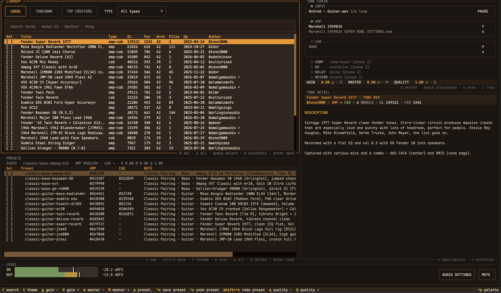

# GigBuddy 🎸 — Your tone, in seconds

*v0.1.0-alpha.7 — 2026-08-06*

A guitar tone manager that puts TONE3000's community library of **NAM amp models
and cabinet IRs** right at your fingertips: search, audition, compare, and chain
the tones you like — then play through them in realtime or render them to wav.



## Features

- **Huge library, zero setup** — Browse TONE3000's community tone library live
  from the TUI: thousands of NAM amp captures and cabinet IRs, searchable on
  demand. No local database to build, nothing to manage.
- **Instant audition** — The realtime engine hot-swaps any amp or IR in ~0.3s.
  Select a tone and it's playing before you finish the thought — with your dry
  input or a reference file behind it.
- **Find the right tone fast** — Search by keywords, `@author`, `#tag`, or exact
  `make:"..."`; filter by gear type (amp / cab / full rig); sort by downloads,
  favorites, or recency; jump into any creator's tones from the TOP CREATORS
  leaderboard.
- **Compare in seconds** — Step through every capture in a tone pack with `↑/↓`
  (same amp, different mics and knob settings), flip any node to BYPASS to hear
  your guitar straight, and inspect full capture metadata in the detail pane.
- **14 classic rigs out of the box** — Plexi, JCM800, Twin Reverb, AC30, Hiwatt,
  Dumble, Mesa… plus 4 bass presets (SVT, B-15, Bassman, GK). Auto-downloaded
  and ready on first launch.
- **A real signal chain** — AMP + CAB nodes with gain / master / quality
  controls, live level meter, and a realtime engine you can also run headless.
- **Offline render** — When you want a recording, not a rehearsal: export your
  chain to a wav file in one command.

## Install (macOS)

```bash
curl -fsSL https://raw.githubusercontent.com/ytxing/gigbuddy/v0.1.0-alpha.7/scripts/install.sh | bash
```

The installer creates an isolated environment under `~/.local/share/gigbuddy`,
builds the audio engines, and exposes `gigbuddy` through `~/.local/bin`. Set
`GIGBUDDY_HOME` or `GIGBUDDY_BIN_DIR` to use different paths.

**First run**: open the TUI (`gigbuddy`) and the 14 built-in presets set
themselves up — it downloads their 19 backing models (14 amps + 5 cabinet IRs,
~5.6MB, one-time) and seeds the catalog. Idempotent and failure-safe: it only
runs once, and retries on the next launch if the network drops mid-way.

**Uninstall** (asks whether to keep your tones and data; keeps Homebrew
PortAudio):

```bash
curl -fsSL https://raw.githubusercontent.com/ytxing/gigbuddy/v0.1.0-alpha.7/scripts/uninstall.sh | bash
```

For a Python-only CLI install without the realtime engine:
`uv tool install git+https://github.com/ytxing/gigbuddy.git`

## Quick start

```bash
gigbuddy                      # open the TUI (starts the realtime engine)
gigbuddy preset list          # 14 built-in presets, ready to go
gigbuddy preset load classic-guitar-plexi   # apply + engine hot-swap
```

Inside the TUI:

- **Search TONE3000** from the library browser, e.g. `super reverb @tone3000`,
  `tag:"edge of breakup" marshall`, `make:"Two Rock Traditional Clean"`.
- **Audition**: press enter on any tone — the engine swaps to it instantly.
- **A/B**: `↑/↓` on the AMP or CAB node steps through the tone pack's other
  captures; double-click a node to BYPASS it and hear your guitar straight.
- **Presets**: `p` pick, `ctrl+s` save the current chain as a preset.

## Architecture (in brief)

GigBuddy is three pieces that talk through stable interfaces: a **Textual TUI**
that browses TONE3000 and drives the chain, a **realtime engine** (PortAudio +
NeuralAudio) that hot-swaps amps/IRs and reports levels, and a **SQLite library
+ CLI** that any tool — including AI agents — can query and write. Tones come
from the TONE3000 public API; the core stack is fully MIT.

```
                                          ┌────────────────────────────────┐
                                          │ External clients                │
                                          │ Claude Code + skill · pi · ...  │
                                          └───────────────┬────────────────┘
                                                          │ CLI commands
                                                          ▼
┌─────────────────────────────┐     ┌──────────────────────────────────────┐
│ TONE3000 public API         │────▶│ gigbuddy CLI                        │
│ search · metadata · models  │     │ tone · chain · preset                │
└──────────────┬──────────────┘     └───────────────┬──────────────────────┘
               │ remote search / import             │ query / write
               ▼                                    ▼
┌─────────────────────────────┐     ┌──────────────────────────────────────┐
│ Textual tone library UI     │◄───▶│ Local state                          │
│ browse · search · import    │     │ SQLite  data/gigbuddy.db             │
│ chain control · level meter │     │ Files   live_chain.json · level.json │
└─────────────────────────────┘     └──────────────────┬───────────────────┘
                                                       │ --live / --level-file
                                                       ▼
                                      ┌──────────────────────────────────────┐
                                      │ realtime_cli                         │
                                      │ PortAudio + NeuralAudio              │
                                      │ hot-swap model/IR · level telemetry  │
                                      └──────────────────────────────────────┘
```

The engine watches `data/live_chain.json` and swaps model/IR atomically within
~0.3s of a chain write; `data/level.json` feeds the level meter back. Details:
docs/chain-schema.md.

## TUI tour

The TUI starts the realtime engine by default. Use `gigbuddy tui --no-engine`
when an engine is already running in another terminal.

- **Library browser** (left): three tabs — LOCAL (imported tones), TONE3000
  (live search + trending + sortable results with per-tab SORT/TYPE filters) and
  TOP CREATORS (6-column leaderboard: Rank/Creator/Tones/Downloads/Fav/Models;
  enter/double-click a creator row jumps to their `@author` search).
- **Tone-chain panel** (right): INPUT / AMP / CAB nodes with state lamps
  (green active / red BYPASS / grey empty). `↑/↓` on AMP or CAB steps through
  the same tone folder's models; the CAB row has its own ▲/▼ arrow buttons.
  Double-click toggles BYPASS (engine pass-through, content kept). Parameters
  are fully editable: `g·G / m·M / q·Q` click to step, hold for fast long-press
  stepping, click the dot to zero, and click the value to type it directly
  (gain/master 0–10, quality 0–1). `d` unloads a slot.
- **Detail pane** (right, under the chain): dual-mode — Description
  (metadata) ↔ Selection (pack file list, hot-swap with enter) switched by
  `←/→`. Focusing a TOP CREATORS row shows that author's profile (bio +
  verified badge, cached locally).
- **AUDIO**: the compact bar keeps live levels + MUTE; AUDIO SETTINGS has
  input/output devices (System Default first), buffer, sample rate and latency.
- **Dry input playback**: the INPUT row can play a dry guitar file
  (space play/pause, s stop, l loop) — pick the source with enter.
- **Presets**: `p` opens the preset picker, `ctrl+s` saves, `ctrl+shift+s`
  saves as new; `ctrl+z` undoes the last preset application.
- **Level meter** (bottom): 0.3s refresh from the engine.

## CLI reference (for agents & developers)

```
gigbuddy tone list [--gear amp|cab|amp-cab] [--limit N] [--query Q] [--json]
gigbuddy tone search <query> [--gear ...] [--limit N] [--json]   # TONE3000 live
gigbuddy tone show <id> [--json]                                 # full metadata
gigbuddy tone import <id>                                        # download + persist
gigbuddy chain get                                               # cat live_chain.json
gigbuddy chain set '<json>'                                      # write it (hot-swap)
gigbuddy preset seed                                             # add/update built-in catalog
gigbuddy preset seed --replace                                   # delete all presets, rebuild catalog
gigbuddy preset list                                             # named chain snapshots
gigbuddy preset save <name> [--note "..."]                       # snapshot current chain
gigbuddy preset load <name>                                      # apply (engine hot-swap)
gigbuddy preset current                                          # active name; * means dirty
gigbuddy preset rename <old> <new>                               # rename, preserving active
gigbuddy preset note <name> [note]                               # set / clear description
gigbuddy preset show <name> / delete <name>                      # inspect / remove
```

Presets store model **logic references** (`model_id`), resolved to current paths
at load time — library renames never break a preset. The active preset is shared
by the CLI and TUI. In the PRESETS pane, `space` / `a` / `d` / `esc` select,
select all, bulk delete, and clear; `n` / `r` / `e` create, rename, or edit the
focused preset. LOCAL uses the same selection model; uninstalling moves managed
files to `data/.trash`, clears `models.local_path`, and retains metadata.

Notes:
- `gear` domain is `amp` / `cab` / `amp-cab` (no `ir`); IR tones are `gear=cab`, `platform=ir`.
- Import is idempotent (files skip when present, rows upsert). Files are grouped
  under `data/tones/<tone-id>-<title-slug>/` and keep TONE3000's **semantic model
  name** (`models.name`, same as the site's zip download — spaces preserved);
  use `tone show` for the real path. IR tones record architecture `"IR"` and
  download `.wav` files.
- The gigbuddy skill (`.claude/skills/gigbuddy`) drives this CLI end to end; its
  anti-invention rules (tone ids only from real search output) apply to any agent use.

## Manual / developer setup

The installer above already does this; from a checkout:

```bash
# 1. Create the local Python environment (Python 3.11+)
python3 -m venv .venv
.venv/bin/python -m pip install -U pip
.venv/bin/python -m pip install -e '.[dev]'

# 2. Fetch pinned C++ dependencies (macOS build path)
./scripts/bootstrap_third_party.sh

# 3. Build the engine (needs clang++ and Homebrew PortAudio)
./cpp/build.sh

# 4. Explore TONE3000 (the TUI also does this interactively)
.venv/bin/gigbuddy tone search "fender super reverb"     # search TONE3000
.venv/bin/gigbuddy tone import 19                        # download + persist metadata to DB
.venv/bin/gigbuddy tone list                             # browse the local library
.venv/bin/gigbuddy tone show 19                          # full metadata + local files

# 5. Point the engine at a chain (file names = TONE3000 semantic model names)
.venv/bin/gigbuddy chain set '{"model": "data/tones/19-fender-super-reverb-1977/Fender Super Reverb: EQ Flat, Volume 3, sm57.nam", "gain": 1.0, "master": 0.8}'
.venv/bin/gigbuddy chain get

# 6. Offline render (optional, when you want a wav file)
python3 src/render.py chain.json data/dry.wav out.wav
```

## Directory structure

```
cpp/            nam_cli.cpp (offline NAM render CLI)
                realtime_cli.cpp (realtime engine: --live hot-swap + --level-file + VU)
src/            library.py (SQLite schema + gigbuddy CLI) / tone3000.py (TONE3000 layer)
                render.py (offline render pipeline)
tui/            Textual UI: app.py (layout/hotkeys) / panels.py (chain/detail/meter)
                library_panel.py (browser) / picker.py (tone picker) / live.py (file channel)
scripts/        gen_test_wav.py (fallback test-signal generator)
data/           (gitignored: dry inputs / outputs / tone cache / live_chain.json / level.json / gigbuddy.db)
third_party/    (gitignored: NeuralAudio + deps, fetched by scripts)
docs/           SPEC-v2.md (decoupled architecture) / chain-schema.md (chain DSL)
```

## Tone-chain format

Current live chain (`data/live_chain.json`) keys: `model` (.nam path), `ir` (.wav IR
path, optional), `gain`, `master`, `quality` (A2 model sub-model size, 0–1,
1.0 = full precision; TUI `q`/`Q`). Full DSL and node semantics:
docs/chain-schema.md.

## Known limitations (v0.1)

- **TOP CREATORS** reads TONE3000's official `user_public_counts` leaderboard,
  the same source used by `tone3000.com/top-creators`. Tones, Downloads,
  Favorites, and Models are stable server-side aggregates.
- **Creator followers/following** are not shown: the public users API exposes
  no follower fields and the website is behind Cloudflare.
- **Remote data loads are network-bound** — the first TOP CREATORS visit waits
  for one leaderboard request; displayed statistics are not rewritten later.
- Notifications and a few table refreshes are timing-sensitive under heavy
  load; rare test flakes have been observed in CI-style runs.

## License

GigBuddy is released under the MIT License; see `LICENSE`. Third-party dependency
licenses and the TONE3000/model redistribution boundary are documented in `NOTICE.md`.

## Roadmap

- [x] MVP: render core (NeuralAudio) + amp/IR pipeline + TONE3000 retrieval layer
- [x] Blueprint DSL v0.1 (docs/chain-schema.md) + GigBuddy skill (NL → chain → render)
- [x] Realtime engine: hot-swap (--live), level telemetry, USB interface verified
- [x] v2 decoupling: SQLite tone library (full metadata) + gigbuddy CLI + TUI browser
      (agent removed from TUI; DB open to external agents)
- [ ] Local VST3 effects (pedalboard, subprocess-isolated; activate placeholder nodes)
- [ ] Crossfade switching (anti-click, guitarix delta-delay style)
- [ ] Render-vs-reference automatic evaluation loop
- [ ] AudioStream interface output
