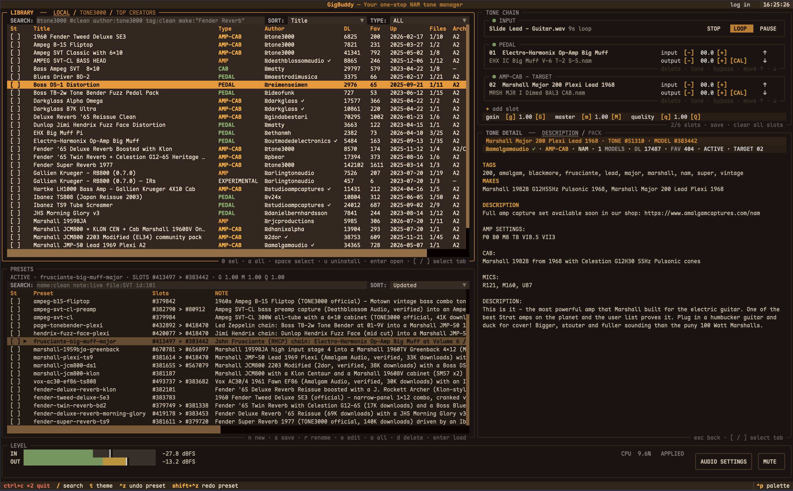

# GigBuddy 🎸 — Your one-stop NAM tone manager

**🌐 Language:** [English](README.md) · [中文](README.zh-CN.md)

[](https://github.com/ytxing/gigbuddy)
[](https://www.tone3000.com/blog/introducing-neural-amp-modeler-nam-architecture-2-a2)
[](https://github.com/ytxing/gigbuddy/releases)
[](LICENSE)
[](https://www.python.org)
[](https://github.com/ytxing/gigbuddy)

*Find a sound. Shape it. Play it now.*

There are already plenty of tones on [TONE3000](https://www.tone3000). Then I
open one tone pack and find even more NAM files inside, each captured with
different settings. That's when I start asking myself:

- 🤔 Which NAM file should I try with my guitar, bass, pickups, and playing style?
- 😵‍💫 What will this NAM capture or IR actually sound like with my setup?
- 💫 If I chain several NAM files and IRs into a pedal -> amp -> cab rig, what will I get?
- 🗂️ If I want to A/B the NAM files in a tone pack, do I really have to pick them one
  by one in a plugin?
- 😵 What if the filenames tell me nothing? How am I supposed to find the next capture?
- 💭 Once I switch, will I even remember what the last one sounded like?

So I built GigBuddy: a searchable library for tone packs, NAM files, and IRs. I
can try them with the same dry recording or my own instrument, keep track of
which file I am hearing, and build the chain once I find a sound that works.

*v1.1.4 · 2026-08-11* · [v1.2.0 changes on `main`](docs/releases/v1.2.0.md)

**One line from the terminal — downloads, installs, and initializes everything:**

```
curl -sSL https://raw.githubusercontent.com/ytxing/gigbuddy/v1.1.4/scripts/install.sh | bash
```


GigBuddy is a realtime [NAM (Neural Amp Modeler)](https://www.tone3000.com/guides/nam-a2-the-complete-guide)
tone workspace with full **A2 architecture** support — the most faithful
amp-capture technology, which outplayed Neural DSP, ToneX, and Line 6 Proxy in
TONE3000's 1,000-participant [blind listening
test](https://www.tone3000.com/guides/nam-a2-the-complete-guide#amp-modeler-blind-listening-test).
It pairs a tone-library browser and a realtime NAM engine with an SQLite
library that AI agents can drive through a stable CLI.

Find a tone, audition it with a dry recording or your own guitar, shape the
chain, and keep the version that works — your sounds stay local while the live
engine keeps playing.

**Open-source stance**: pure-API data source (zero local tone-library
dependency), fully MIT core stack.

## Why GigBuddy

- ⚡ **Find tones in seconds.** Search, filter, and sort the whole TONE3000
  catalog right inside the app — by keyword, author, tag, make, gear type, or
  trending — instead of paging through the website and downloading one capture
  at a time.
- 🎧 **Compare sounds side by side.** Audition any capture with the same dry
  guitar or bass recording, then swap models and cabinets in the chain and
  A/B them instantly — no tab-hopping, no guesswork.
- 🎤 **Play it with your own guitar.** Plug in and play for real — audition a
  tone live with your instrument, or loop a dry recording and screen through
  captures hands-free.
- 🔧 **Shape the signal path like a pedalboard.** Build an ordered chain of up
  to six Slots ([NAM](https://www.tone3000.com/guides/neural-amp-modeler#what-is-nam)
  captures and [cabinet IRs](https://www.tone3000.com/guides/neural-amp-modeler#what-s-the-difference-between-nam-and-ir-s)),
  then add, remove, reorder, bypass, or restore a stage while the realtime
  engine keeps playing.
- 🎸 **Save the rig, not just the settings.** Presets capture the whole chain —
  model references, parameters, and notes — and bring it back with one action,
  overwriting the current preset or saving under a new name.
- 📦 **One manager for everything.** Tones, models, files, download state, and
  presets live together in a searchable local library — install, uninstall,
  batch-select, and edit without leaving the workbench.
- 🤖 **Agent-friendly.** GigBuddy ships a skill for AI agents: ask for a tone —
  "the most-favorited Fender amp," "the most-downloaded bass overdrive" — and
  an agent can search, filter, and build or refine your presets for you.
- 🎨 **Make it feel like your rig.** Six amp-inspired themes — press `t` to
  cycle through orange tolex, tweed brass, diamond noir, blackface silver,
  British green, and surf cream.



See the [panel-by-panel guide](https://github.com/ytxing/gigbuddy/blob/main/docs/gigbuddy-panels.md) for a closer look at the Library, Tone Chain, Tone Detail, Presets, and Audio / Level views.

## What's new

The full change list since `v1.1.4` is in the [v1.2.0 release note](docs/releases/v1.2.0.md).
The short version: TONE3000 search now follows the official default ranking and
A2 filter, and LOCAL now manages both downloaded remote Packs and user-owned
local Packs. The [tone file management guide](docs/tone-file-management.md)
covers the customer workflow, paths, manifests, and file limits.

GigBuddy turns the original tone-chain console into a complete tone workbench:

- **Flexible chains:** the old fixed AMP/CAB view is now an ordered chain of up
  to six Slots. A Slot can hold any supported NAM model or `.wav` IR, so the
  signal path follows the way you actually build a rig. Any Slot can be turned
  off on its own and switched back on whenever you like — the rest of the
  chain keeps playing, and your setup is exactly where you left it next time
  you open the app.
- **Per-Slot level control:** every Slot has independent input and output trim
  controls from -24 to +24 dB. The engine-backed `CAL` action can recommend a
  NAM output trim, reports when the safe range clamps that recommendation, and
  keeps the result with the preset.
- **Your TONE3000 account, your session:** sign in through the system browser
  with OAuth 2.0 + PKCE. The header shows the current login state, the library
  offers a direct login action when remote data needs it, and both the TUI and
  CLI can log out and clear the local session.
- **Live work stays in place:** remote model loading, pack refreshes, preset
  changes, and dry-input playback are queued away from the Textual event loop;
  focus, selection, and the latest user action survive late network or engine
  replies.
- **A library that remembers your work:** imported tones, model metadata, local
  files, download state, and presets are kept together in one searchable local
  library.
- **A clearer way to compare:** LOCAL, TONE3000, and TOP CREATORS views share
  live search, sorting, type filters, creator profiles, and pack-level install
  flows. The deprecated **A1** architecture is filtered out of downloads,
  browsing, and display, so your library only ever presents A2 and IR files.
- **Presets that behave like real rigs:** the starter catalog ships with 20
  curated guitar and bass chains — brand + model + cabinet naming (Fender,
  Vox, Marshall, Ampeg, Gallien-Krueger, Hartke, Darkglass), chosen from
  high-download and verified-author captures.
- **Pedals and fuzz built into presets:** classic drive pedals (Ibanez TS9 /
  TS808, JHS Morning Glory, Boss BD-2 / DS-1 / TB-2w) and fuzz chains
  (Big Muff → Marshall Major, Fuzz Face → Plexi, ToneBender → Plexi) ride in
  the preset slots with their classic knob settings; optional tonal-shaping
  IRs are preloaded but off until you want them.
- **A better practice loop:** the INPUT row can play, pause, stop, and loop dry
  guitar or bass recordings — via the keyboard (`space`/`s`/`l`) or the
  STOP / LOOP / PLAY buttons on the row itself — while AUDIO keeps level,
  mute, device, buffer, sample-rate, and latency controls visible.
- **Smooth sound changes:** switching presets, swapping models, or turning a
  Slot on and off never clicks or dips the signal, even on a sustained note.
- **A workspace that stays understandable:** focus, selection, installation,
  preset editing, and destructive actions remain in the pane where they belong.
- **A quieter runtime:** the Audio / Level view reports unified TUI and managed
  engine CPU usage, while polling, catalog refreshes, and unchanged redraws are
  kept off the hot path.
- **Model changes start clean:** replacing a model restores neutral Slot input
  and output trims; bypass and restore preserve the existing model's trims.

## Start playing

The one-line install above places GigBuddy in `~/.local/share/gigbuddy` and
links the `gigbuddy` command
into `~/.local/bin`. Run `gigbuddy` with no arguments to open the TUI; add a
subcommand (`tone`, `chain`, `preset`) for the CLI. Run interactively and you can choose another location —
`"."` for the current directory or any path (useful when you want the bundled
agent skill available inside your own project folder); set `GIGBUDDY_HOME` to
skip the prompt. To remove a user-level install, run the matching uninstall
script:

```
curl -sSL https://raw.githubusercontent.com/ytxing/gigbuddy/v1.1.4/scripts/uninstall.sh | bash
```

The standalone uninstaller removes the local install, generated runtime files,
and the persisted TONE3000 session. Use `--keep-data` when you want to remove
the runtime while keeping downloaded tones and local data; the login session is
still removed:

```
curl -sSL https://raw.githubusercontent.com/ytxing/gigbuddy/v1.1.4/scripts/uninstall.sh | bash -s -- --keep-data
```

From a fresh checkout:

```
# Creates the Python environment, local library, starter presets,
# official dry inputs, and the realtime engine. If no TONE3000 session is
# found, the installer asks whether to log in and opens the system browser.
./install.sh

# Optional: browse the TUI without compiling the native engine.
./install.sh --no-engine --starter-dry

# Launch GigBuddy.
.venv/bin/python -m tui
```

The default install prepares the exact models used by the built-in preset
catalog and all 34 official TONE3000 dry-input WAV files. It is safe to rerun:
existing database rows and non-empty files are reused. `--starter-dry` keeps the
first download to ten common guitar samples.

The user-level installer performs the same login check before its bootstrap.
Press `Y` or Enter to sign in, or `n` to continue without starter models; the
installer prints the OAuth URL even when it opens the browser automatically.
When no interactive terminal is available, the installer stops instead of
silently skipping the check; pass `bash -s -- --skip-presets` explicitly when
installing without starter models. After logging in later, run `gigbuddy preset
bootstrap` to add the starter presets and models.

To inspect the interface without an audio backend, launch with:

```
.venv/bin/python -m tui --no-engine
```

The native engine build currently targets macOS: PortAudio 19.7.0 is built
from source into the install directory (no package manager required), using
the system compiler and CoreAudio framework. The TUI and library remain useful
with `--no-engine` when those tools are not available.

To wipe all local data, the Python environment, and the built engine and start
fresh, run the one-line uninstall:

```
./uninstall.sh
```

## A first session

1. Open **PRESETS** and load a starter rig, or open **TONE3000** and search for
   a sound such as `super reverb`, `vox ac30`, or `darkglass`.
   If the remote view asks for authentication, choose `log in` in the header
   or run `gigbuddy tone login`; complete the TONE3000 flow in your browser.
2. Focus **INPUT**, press `enter`, and choose a dry guitar or bass recording.
   Press `space` to play, `s` to stop, or `l` to loop.
3. Select a Slot and use its pack view to choose the exact model or IR you want.
   Press `enter` to load it into the focused Slot.
4. Compare variations with `↑`/`↓`, move a stage with `alt+↑`/`alt+↓`, or press
   `enter` on an active stage to bypass and restore it.
5. Save the result from **PRESETS**. Use `s` to update the active preset or `n`
   to save a new named rig with a note.

Presets are editable JSON files in `data/presets/`, so rigs can be backed up or
reviewed outside GigBuddy. SQLite remains the local index. A hand-edited JSON
file is reconciled when GigBuddy reads the preset; invalid JSON is preserved and
reported instead of replacing the last indexed snapshot.

The global command palette (`ctrl+p`) can focus Presets, open audio settings,
change the theme, or find the main commands without memorizing every key.

## Find and keep tones

GigBuddy gives you three ways to start:

- **LOCAL** is your downloaded library. It keeps the full TONE3000 metadata,
  shows what is installed, and lets you install or uninstall at tone or model
  level.
- **TONE3000** is live search over the public catalog, with trending results,
  sorting, type filters, and pack-level model selection.
- **TOP CREATORS** lets you browse the official creator leaderboard, inspect a
  creator profile, and jump straight into that creator's tones.

Search can stay simple or become precise:

```
super reverb @tone3000
author:tone3000 tag:clean super reverb
make:"Two Rock Traditional Clean" @coretonecaptures
tag:"edge of breakup" marshall
```

Search first, then import the real ID returned by TONE3000:

```
bin/gigbuddy tone search "fender super reverb"
bin/gigbuddy tone import <tone-id>
bin/gigbuddy tone list
bin/gigbuddy tone show <tone-id>
```

Import is idempotent. Every imported tone is one Pack folder under `data/tones/`:
the downloaded NAM/IR files are direct children of that folder, and remote
imports also write an optional `gigbuddy.json` manifest beside them. NAM
captures use `.nam`; cabinet and other IR assets use `.wav`. SQLite remains
GigBuddy's searchable index, while the Pack folder contains the actual files.

```text
data/tones/<tone-id>-<title-slug>/
  gigbuddy.json       # optional Pack metadata; generated for remote imports
  <model-name>.nam
  <ir-name>.wav
```

See the customer-facing [GigBuddy tone file management guide](docs/tone-file-management.md)
for the remote download layout, local Pack workflow, manifest format, preset
behavior, and current file limits. The older [local Tone Pack design note](docs/local-tone-pack-design.md)
keeps the engineering schema and boundary details.

## Make a rig your own

Every capture is built on [Neural Amp Modeler (NAM)](https://www.tone3000.com/guides/neural-amp-modeler#what-is-nam)
— the community's most faithful amp-capture technology: every tone is a real
amp through real mics, captured rather than approximated. GigBuddy is built
around TONE3000's next-generation [A2 architecture](https://www.tone3000.com/blog/introducing-neural-amp-modeler-nam-architecture-2-a2),
which TONE3000 calls "the most accurate and best sounding amp modeling
technology in history" — it outplayed Neural DSP, ToneX, and Line 6 Proxy in
their 1,000-participant [blind listening test](https://www.tone3000.com/blog/introducing-neural-amp-modeler-nam-architecture-2-a2#amp-modeler-blind-listening-test).
NAM captures and cabinet IRs play different roles in a rig —
[the difference, explained](https://www.tone3000.com/guides/neural-amp-modeler#what-s-the-difference-between-nam-and-ir-s).

The chain is deliberately simple to reason about:

```
INPUT → gain → Slot 1 → Slot 2 → … → Slot 6 → master → OUTPUT
```

Empty Slots are harmless signal-through positions. Any Slot can be turned off
on its own and switched back on at any time, without touching the rest of the
chain. Slot order is the signal order, and the same model may be used more
than once when you want to stack a stage. Gain, master, and NAM quality are
chain-level controls you can adjust live; mute is a live output control and
does not erase the saved master setting.

Presets let you capture a whole rig — chain, model references, parameters, and
notes — and bring it back with one action, either overwriting the current
preset or saving under a new name. They are shared by the TUI and CLI, store
stable model references, and resolve the current local file path when loaded,
so reorganizing your library does not silently break a saved rig. Older flat
`model`/`ir` presets remain readable and are normalized to the Slot format
when used.

## Optional automation

GigBuddy works entirely from the TUI. If you want scripts or an external agent
to drive it, the CLI exposes the same library, chain, and preset operations:

```
gigbuddy tone search "marshall plexi" --json
gigbuddy tone import <tone-id>
gigbuddy tone login
gigbuddy tone logout
gigbuddy preset list
gigbuddy preset load <name>
gigbuddy chain get
gigbuddy chain set '{"slots": [], "gain": 1.0, "master": 1.0}'
```

The CLI and TUI share the local database and `data/live_chain.json`. A running
engine watches that file and applies valid chain changes without requiring a
restart. The guarded agent workflow is shipped at
`.agent/skills/gigbuddy/SKILL.md`; `.claude/skills/gigbuddy` is kept as a
compatibility path. It searches local data first, requires real TONE3000 IDs
and exact imported file paths, and refuses unsupported A1 or non-engine
formats.

### Agent skill

The bundled skill turns a natural-language guitar or bass request into a
traceable search, Model selection, import, chain update, or preset operation.
It documents the complete agent-facing CLI, distinguishes a Tone pack from
its concrete Models, checks local paths before connecting them, and reports
what came from creator metadata versus inference. Remote actions use the
current user's OAuth session and the public TONE3000 request/download boundary;
the skill does not support shared credentials, catalog mirroring, or
background bulk downloads. Read the full workflow in
`.agent/skills/gigbuddy/SKILL.md`.

## TONE3000 integration

GigBuddy connects to TONE3000 as a desktop client. Each person signs in to
their own TONE3000 account through the documented OAuth 2.0 + PKCE flow; the
app does not require a server-side secret key or a shared account. Access and
refresh tokens are stored in the local user configuration with restrictive file
permissions, and `log out` removes the persisted session.

The integration follows the public [TONE3000 API documentation](https://www.tone3000.com/api)
and [API Terms](https://www.tone3000.com/api/terms):

- requests use bearer access tokens, refresh expired sessions, and keep a
  minimum 0.6-second spacing to stay within the documented default of 100
  requests per minute; `Retry-After` is respected when the service returns
  HTTP 429;
- remote pages are bounded, and model files are downloaded only as part of an
  explicit import, Slot selection, or user-invoked starter bootstrap rather
  than as a background catalog mirror;
- creator names, tone metadata, and the source platform remain visible in the
  local library; creator-selected licenses still apply to every downloaded
  file;
- the desktop client does not proxy, pool, or publish one user's TONE3000
  library for other users. Review the current API terms before building a
  hosted or commercial service around this code.

TONE3000's API policy and endpoint availability can change. The official docs
are the authority for OAuth flows, free-tier scope, rate limits, attribution,
and commercial requirements. In particular, the current terms distinguish
free non-commercial integrations from full API/commercial access; check the
listed OAuth prompt and bounded-list scope before publishing a derivative
integration.

## Good to know

- **For the best visual experience, use a truecolor terminal** — iTerm2, Kitty, WezTerm,
  Alacritty, Warp, or Ghostty all render the guitar-amp themes correctly
  (macOS's built-in Terminal.app only supports 256 colors and falls back to
  the compatible theme). On 16-color terminals GigBuddy automatically switches to
  a compatible theme; to force the full theme anyway, run
  `TEXTUAL_COLOR_SYSTEM=truecolor gigbuddy`.
- `--no-engine` is a browse-and-edit mode; live audio and level telemetry need
  the native engine and an available audio device.
- TONE3000 search, creator views, model details, and downloads need network
  access and an active user login; the LOCAL library and saved presets remain
  usable offline.
- Core code is MIT. The runtime uses NeuralAudio, NAM Core, RTNeural, Eigen,
  PortAudio, and Textual under their respective licenses.

## What's next

- Local VST3 effects and pedalboard stages
- Render-versus-reference tone evaluation
- Additional audio-stream output options

## Dependencies

Pinned versions (v1.1.4). Update `requirements.txt` and the NeuralAudio commit
in `install.sh` together when bumping.

**Python runtime** (`requirements.txt`):

| Package | Version | License | Role |
|---|---|---|---|
| textual | 8.2.8 | MIT | TUI framework |
| numpy | 2.5.1 | BSD-3-Clause | offline rendering |

**Native engine** (fetched by `install.sh`, pinned in-tree):

| Component | Version | License | Role |
|---|---|---|---|
| NeuralAudio | commit `49100f9` | MIT | NAM inference runtime |
| NAM Core | (NeuralAudio submodule) | MIT | amp-model DSP |
| RTNeural | (NeuralAudio submodule) | BSD-3-Clause | neural inference |
| Eigen | 3.4.0 | MPL-2.0 | linear algebra (patched for NAM) |
| math_approx | (NeuralAudio dep) | MIT | fast math |
| PortAudio | 19.7.0 (built from source) | MIT-like | audio I/O |

**Toolchain**: Xcode Command Line Tools (clang++/git/make), uv (auto-downloaded
if missing — manages Python 3.12 and the venv).

## Known limitations

- **Creator followers/following are not shown.** TONE3000's public API exposes
  no follower counts, so profiles show the official statistics that are
  available.
- **First search, creator view, or download needs network access.** Once a
  tone is imported, its files and metadata are available locally.
- **TOP CREATORS stats are server-side aggregates.** Tones, downloads,
  favorites, and models come from TONE3000's official leaderboard and are not
  refreshed later.

## License

MIT. Dependencies: NeuralAudio (MIT), NAM Core (MIT), RTNeural (BSD-3),
Eigen (MPL-2), math_approx (MIT), PortAudio (MIT-like), Textual (MIT). Pinned
versions in [Dependencies](#dependencies).

## Further reading

- [Interaction guide](docs/ui-interaction-spec-v0.2.md)
- [Tone-chain protocol](docs/adr/0001-slots-chain-protocol.md)
- [Library schema](docs/library-schema.md)
