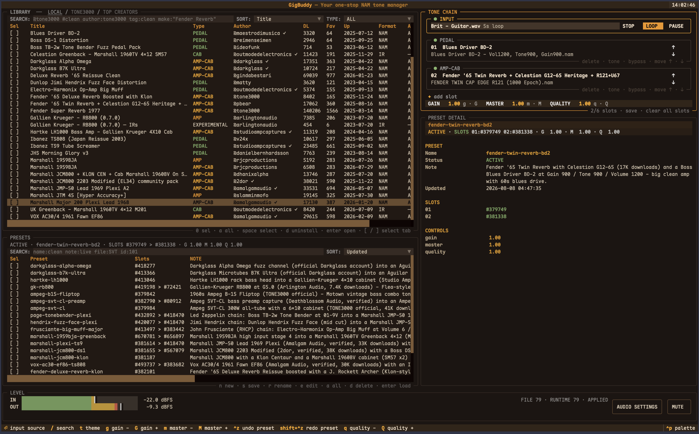

# GigBuddy 🎸

### Find a sound. Shape it. Play it now.

*v1.0.0 · 2026-08-08*

GigBuddy is a realtime NAM tone workspace for guitarists and bassists. Search
the public TONE3000 catalog, audition a sound with a dry recording, build a
signal chain, and hear the result through your interface without leaving the
same workspace.

It is made for the moment when a tone is almost right: swap the capture, move
the cabinet, bypass one stage, compare a preset, and keep the version that
works. Your downloaded sounds stay in a local library, while the live engine
keeps the playing experience immediate.

## Why GigBuddy

- ⚡ **Find tones in seconds.** Search, filter, and sort the whole TONE3000
  catalog right inside the app — by keyword, author, tag, make, gear type, or
  trending — instead of paging through the website and downloading one capture
  at a time.
- 🎧 **Compare sounds side by side.** Audition any capture with the same dry
  guitar or bass recording, then swap models and cabinets in the chain and
  A/B them instantly — no tab-hopping, no guesswork.
- 🎤 **Play it with your own guitar.** Plug in and play for real — audition a
  tone live with your instrument, or loop a dry recording and screen through
  captures hands-free.
- 🔧 **Shape the signal path like a pedalboard.** Build an ordered chain of up
  to six Slots ([NAM](https://www.tone3000.com/guides/neural-amp-modeler#what-is-nam)
  captures and [cabinet IRs](https://www.tone3000.com/guides/neural-amp-modeler#what-s-the-difference-between-nam-and-ir-s)),
  then add, remove, reorder, bypass, or restore a stage while the realtime
  engine keeps playing.
- 🎸 **Save the rig, not just the settings.** Presets capture the whole chain —
  model references, parameters, and notes — and bring it back with one action,
  overwriting the current preset or saving under a new name.
- 📦 **One manager for everything.** Tones, models, files, download state, and
  presets live together in a searchable local library — install, uninstall,
  batch-select, and edit without leaving the workbench.
- 🤖 **Agent-friendly.** GigBuddy ships a skill for AI agents: ask for a tone —
  "the most-favorited Fender amp," "the most-downloaded bass overdrive" — and
  an agent can search, filter, and build or refine your presets for you.
- 🎨 **Make it feel like your rig.** Six amp-inspired themes — press `t` to
  cycle from orange tolex to tweed brass, blackface silver, British green, and
  surf cream.



## What is new in v0.2

v0.2 turns the original tone-chain console into a complete tone workbench:

- **Flexible chains:** the old fixed AMP/CAB view is now an ordered chain of up
  to six Slots. A Slot can hold any supported NAM model or `.wav` IR, so the
  signal path follows the way you actually build a rig.
- **A library that remembers your work:** imported tones, model metadata, local
  files, download state, and presets are kept together in one searchable local
  library.
- **A clearer way to compare:** LOCAL, TONE3000, and TOP CREATORS views share
  live search, sorting, type filters, creator profiles, and pack-level install
  flows.
- **Presets that behave like real rigs:** the starter catalog ships with 20
  curated guitar and bass chains, including classic Fender, Vox, Marshall,
  Ampeg, Gallien-Krueger, and Darkglass sounds.
- **A better practice loop:** the INPUT row can play, pause, stop, and loop dry
  guitar or bass recordings, while AUDIO keeps level, mute, device, buffer,
  sample-rate, and latency controls visible.
- **A workspace that stays understandable:** focus, selection, installation,
  preset editing, and destructive actions remain in the pane where they belong.

## Start playing

One line from the terminal — downloads, installs, and initializes everything
(animated GigBuddy banner included):

```
curl -sSL https://raw.githubusercontent.com/ytxing/gigbuddy/v1.0.0/scripts/install.sh | bash
```

It installs into `~/.local/share/gigbuddy` and links `gigbuddy` / `gigbuddy-tui`
into `~/.local/bin`. Remove everything with `~/.local/bin/gigbuddy`'s sibling:

```
curl -sSL https://raw.githubusercontent.com/ytxing/gigbuddy/v1.0.0/scripts/uninstall.sh | bash
```

From a fresh checkout:

```
# Creates the Python environment, local library, starter presets,
# official dry inputs, and the realtime engine.
./install.sh

# Optional: browse the TUI without compiling the native engine.
./install.sh --no-engine --starter-dry

# Launch GigBuddy.
.venv/bin/python -m tui
```

The default install prepares the exact models used by the built-in preset
catalog and all 34 official TONE3000 dry-input WAV files. It is safe to rerun:
existing database rows and non-empty files are reused. `--starter-dry` keeps the
first download to ten common guitar samples.

To inspect the interface without an audio backend, launch with:

```
.venv/bin/python -m tui --no-engine
```

The native engine build currently targets macOS and uses Homebrew PortAudio,
clang++, and CMake. The TUI and library remain useful with `--no-engine` when
those tools are not available.

To wipe all local data, the Python environment, and the built engine and start
fresh, run the one-line uninstall:

```
./uninstall.sh
```

## A first session

1. Open **PRESETS** and load a starter rig, or open **TONE3000** and search for
   a sound such as `super reverb`, `vox ac30`, or `darkglass`.
2. Focus **INPUT**, press `enter`, and choose a dry guitar or bass recording.
   Press `space` to play, `s` to stop, or `l` to loop.
3. Select a Slot and use its pack view to choose the exact model or IR you want.
   Press `enter` to load it into the focused Slot.
4. Compare variations with `↑`/`↓`, move a stage with `alt+↑`/`alt+↓`, or press
   `enter` on an active stage to bypass and restore it.
5. Save the result from **PRESETS**. Use `s` to update the active preset or `n`
   to save a new named rig with a note.

The global command palette (`ctrl+p`) can focus Presets, open audio settings,
change the theme, or find the main commands without memorizing every key.

## Find and keep tones

GigBuddy gives you three ways to start:

- **LOCAL** is your downloaded library. It keeps the full TONE3000 metadata,
  shows what is installed, and lets you install or uninstall at tone or model
  level.
- **TONE3000** is live search over the public catalog, with trending results,
  sorting, type filters, and pack-level model selection.
- **TOP CREATORS** lets you browse the official creator leaderboard, inspect a
  creator profile, and jump straight into that creator's tones.

Search can stay simple or become precise:

```
super reverb @tone3000
author:tone3000 tag:clean super reverb
make:"Two Rock Traditional Clean" @coretonecaptures
tag:"edge of breakup" marshall
```

Search first, then import the real ID returned by TONE3000:

```
bin/gigbuddy tone search "fender super reverb"
bin/gigbuddy tone import <tone-id>
bin/gigbuddy tone list
bin/gigbuddy tone show <tone-id>
```

Import is idempotent. Files are stored under `data/tones/`, while metadata stays
queryable in `data/gigbuddy.db`. NAM captures use `.nam`; cabinet and other IR
assets use `.wav`.

## Make a rig your own

Every capture is built on [Neural Amp Modeler (NAM)](https://www.tone3000.com/guides/neural-amp-modeler#what-is-nam)
— the community's most faithful amp-capture technology: every tone is a real
amp through real mics, captured rather than approximated. GigBuddy is built
around TONE3000's next-generation [A2 architecture](https://www.tone3000.com/blog/introducing-neural-amp-modeler-nam-architecture-2-a2),
which TONE3000 calls "the most accurate and best sounding amp modeling
technology in history" — it outplayed Neural DSP, ToneX, and Line 6 Proxy in
their 1,000-participant [blind listening test](https://www.tone3000.com/blog/introducing-neural-amp-modeler-nam-architecture-2-a2#amp-modeler-blind-listening-test).
NAM captures and cabinet IRs play different roles in a rig —
[the difference, explained](https://www.tone3000.com/guides/neural-amp-modeler#what-s-the-difference-between-nam-and-ir-s).

The chain is deliberately simple to reason about:

```
INPUT → gain → Slot 1 → Slot 2 → … → Slot 6 → master → OUTPUT
```

Empty Slots are harmless signal-through positions. Slot order is the signal
order, and the same model may be used more than once when you want to stack a
stage. Gain, master, and NAM quality are chain-level controls you can adjust
live; mute is a live output control and does not erase the saved master
setting.

Presets let you capture a whole rig — chain, model references, parameters, and
notes — and bring it back with one action, either overwriting the current
preset or saving under a new name. They are shared by the TUI and CLI, store
stable model references, and resolve the current local file path when loaded,
so reorganizing your library does not silently break a saved rig. Older flat
`model`/`ir` presets remain readable and are normalized to the v0.2 Slot format
when used.

## Optional automation

GigBuddy works entirely from the TUI. If you want scripts or an external agent
to drive it, the CLI exposes the same library, chain, and preset operations:

```
gigbuddy tone search "marshall plexi" --json
gigbuddy tone import <tone-id>
gigbuddy preset list
gigbuddy preset load <name>
gigbuddy chain get
gigbuddy chain set '{"slots": [], "gain": 1.0, "master": 1.0}'
```

The CLI and TUI share the local database and `data/live_chain.json`. A running
engine watches that file and applies valid chain changes without requiring a
restart. The `gigbuddy` skill under `.claude/skills/gigbuddy` adds a guarded
natural-language workflow for agents; it only uses tone IDs returned by real
search results.

## Good to know

- The first search, creator view, or download needs network access. Once a tone
  is imported, its files and metadata are available locally.
- `--no-engine` is a browse-and-edit mode; live audio and level telemetry need
  the native engine and an available audio device.
- The public TONE3000 API does not expose follower/following counts, so creator
  profiles show the official public statistics that are available.
- Core code is MIT. The runtime uses NeuralAudio, NAM Core, RTNeural, Eigen,
  PortAudio, and Textual under their respective licenses.

## What's next

- Local VST3 effects and pedalboard stages
- Crossfade switching for even smoother changes between sounds
- Render-versus-reference tone evaluation
- Additional audio-stream output options

## License

MIT (to be finalized). See the dependency licenses in the source tree.

## Further reading

- [v0.2 interaction guide](docs/ui-interaction-spec-v0.2.md)
- [Tone-chain protocol](docs/adr/0001-slots-chain-protocol.md)
- [Library schema](docs/library-schema.md)
