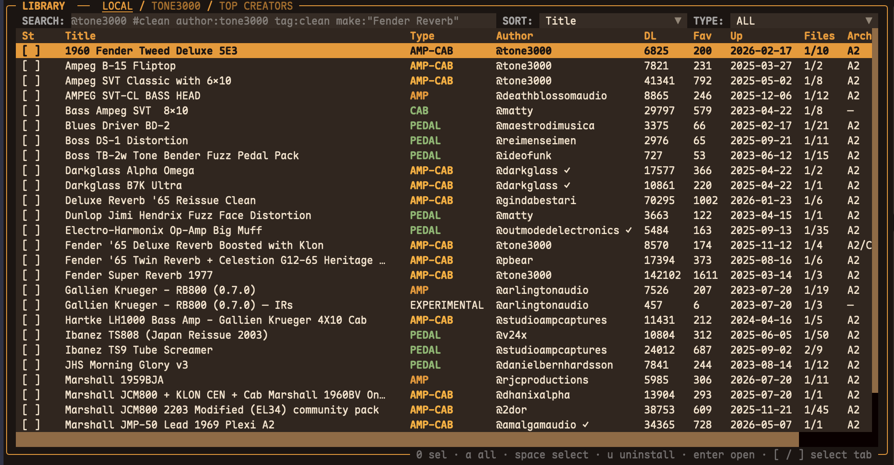
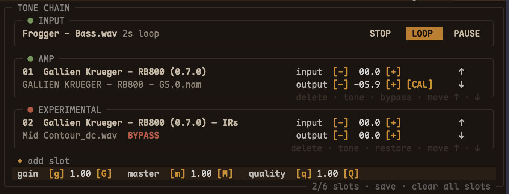
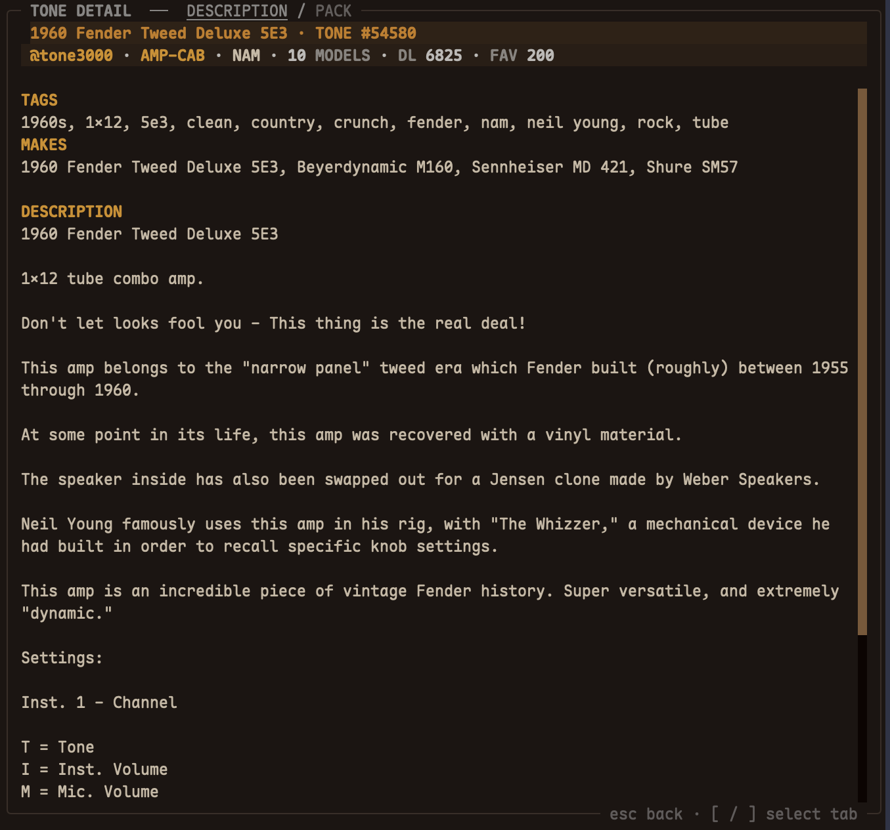
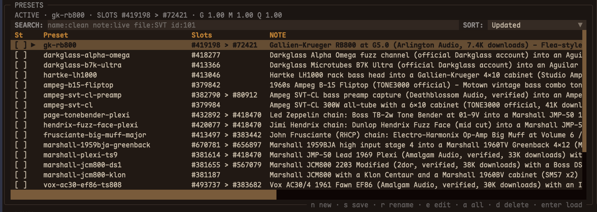
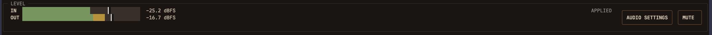

# GigBuddy panels

GigBuddy is a tone discovery and comparison workbench for NAM captures. It
makes a large TONE3000 catalog easier to search, download, organize, and
compare with the same dry recording or live input.

The scope is deliberately focused. GigBuddy is not meant to replace a full
effects chain or plugin host. The chain and audio controls are there to make
auditioning and comparing captures easier. After finding a tone, model, or IR,
you can keep it locally or record its Tone/Model ID for use in another NAM
plugin later.

## Library

The Library is where tone discovery starts. It brings local files and
TONE3000 results into one searchable view, with filters for queries, sort
order, and gear type. The table keeps the details that matter when screening
captures: title, type, author, downloads, favorites, upload date, file count,
and architecture.

This makes it easier to narrow a large catalog to a short list before spending
time downloading and auditioning individual models.

[Open the Library image directly](https://raw.githubusercontent.com/ytxing/gigbuddy/main/docs/screenshots/gigbuddy-library.png)

## Tone Chain

The Tone Chain is a lightweight audition space. It lets you put NAM captures
and cabinet IRs into an ordered signal path, then compare combinations without
leaving the search workflow. Each slot can be bypassed, reordered, and trimmed
for input and output level.

The chain is not intended to be a complete pedalboard or plugin host. Its job
is to make A/B testing practical while you decide which capture works with
your guitar or bass.

[Open the Tone Chain image directly](https://raw.githubusercontent.com/ytxing/gigbuddy/main/docs/screenshots/gigbuddy-tone-chain.png)

## Tone Detail

Tone Detail shows the information behind the currently selected capture. It
includes the author, gear type, model count, downloads, favorites, tags,
microphones, and the full description from TONE3000.

The point is to check what a capture actually contains before downloading it or
using it in a comparison. The Tone and Model identifiers remain available as
part of the local metadata.

[Open the Tone Detail image directly](https://raw.githubusercontent.com/ytxing/gigbuddy/main/docs/screenshots/gigbuddy-tone-detail.png)

## Presets

Presets keep a useful audition setup together. A preset can store the model
references, slot order, per-slot settings, master parameters, and a note about
the rig. That makes it possible to return to a comparison later without
rebuilding the setup from memory.

Presets are also a practical way to keep track of promising Tone/Model IDs
before moving the chosen files into another NAM plugin.

[Open the Presets image directly](https://raw.githubusercontent.com/ytxing/gigbuddy/main/docs/screenshots/gigbuddy-presets.png)

## Audio and level

The bottom bar keeps input and output levels visible while you browse and
compare tones. It shows the current dBFS readings and provides access to Audio
Settings and Mute. The INPUT controls in the Tone Chain view can loop a dry
guitar or bass recording, or pass live input through the audition path.

Using the same dry loop for each candidate makes quick A/B comparisons much
more useful than switching between unrelated demos.

[Open the Audio / Level image directly](https://raw.githubusercontent.com/ytxing/gigbuddy/main/docs/screenshots/gigbuddy-audio-level.png)

## Typical workflow

1. Search and filter TONE3000 until a few candidates look relevant.
2. Inspect their metadata and download the models or IRs worth trying.
3. Use the same dry recording or live input to A/B the candidates.
4. Keep the useful files and metadata locally, or save the Tone/Model IDs for
   use in another NAM plugin.

The goal is to spend less time sorting through a large capture library and
more time playing the sounds that fit the instrument in front of you.
